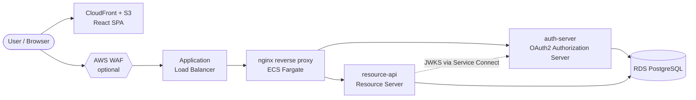

# API Gateway Pilot

A small prototype API gateway architecture on AWS, designed to be torn down
and recreated freely while planning a real migration toward **Amazon API
Gateway** and **Amazon Cognito**.

Everything runs locally with Docker Compose, and deploys to AWS through
**Terraform + GitHub Actions**. The AWS environment is built to be torn down
on demand, so it costs almost nothing when idle.

## What's inside

A monorepo with several independent projects:

| Project | Stack | Purpose |
|---|---|---|
| `auth-server` | Spring Boot 3.5, JDK 21 | OAuth2 Authorization Server — issues JWT access/refresh tokens, form login, PKCE for the SPA |
| `resource-api` | Spring Boot 3.5, JDK 21 | Resource server — serves user & device info, validates JWTs issued by `auth-server` |
| `nginx` | nginx | Reverse proxy — one entry point that routes to both services |
| `web` | Vite + React + TypeScript + shadcn/ui | Single-page app — login and dashboard |
| `docs` | Docusaurus 3 | Documentation site, API reference, and engineering blog |
| `infra` | Terraform | AWS infrastructure (VPC, ECS Fargate, RDS, ALB, ECR, CloudFront) |

## Architecture



> **"nginx ingress / egress"** are Kubernetes concepts (the `nginx-ingress`
> controller) and do not apply here — this is ECS, not EKS. The ALB is ingress;
> egress is the task's route to the internet gateway.

## Prerequisites

- JDK 21 and Maven 3.9+
- Node.js 20+
- Docker Desktop — for the local stack (`make up`)
- Terraform 1.10+ and AWS CLI v2 — only needed to deploy to AWS

## Running locally

```sh
cp .env.example .env
make up        # starts Postgres, auth-server, resource-api, and nginx
make ps        # check status
make down      # stop
```

Then in another terminal, run the SPA:

```sh
cd web && npm install && npm run dev    # http://localhost:5173
```

Sign in with demo user `alice` / password `password`.

Run `make help` to see all targets.

## Repository layout

```
api-gateway-pilot/
├── auth-server/     # Spring Boot OAuth2 Authorization Server
├── resource-api/    # Spring Boot resource server
├── nginx/           # reverse-proxy config + Dockerfile
├── web/             # React SPA
├── docs/            # Docusaurus documentation site
├── infra/           # Terraform
├── docker-compose.yml
├── pom.xml          # parent aggregator POM
└── Makefile
```

## Documentation

The full docs site — architecture, local development, AWS deployment,
troubleshooting, API reference, and the build blog — lives at
**[allxsmith.github.io/api-gateway-pilot](https://allxsmith.github.io/api-gateway-pilot/)**.
