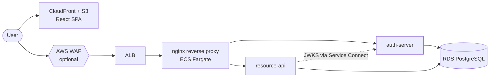

Part 2 stands up the documentation site that everything from here on writes
into. By the end you'll have a Docusaurus site running locally with the
project's brand, a Mermaid diagram on the architecture page, an empty API
Reference section ready for OpenAPI specs, and an `llms.txt` index for AI
crawlers.

{/* truncate */}

## The whole journey

| # | What you'll do |
|---|---|
| 1 | Set up the monorepo |
| 2 | **A Docusaurus docs site** *(you are here)* |
| 3 | auth-server — OAuth2 Authorization Server with a legacy client table |
| 4 | resource-api — the resource server |
| 5 | nginx reverse proxy |
| 6 | The React SPA |
| 7 | Terraform infrastructure |
| 8 | GitHub Actions — CI and CD |
| 9 | AWS account setup |
| 10 | First deploy and teardown |

## Prerequisites

- Part 1 done — you have the `api-gateway-pilot/` monorepo with Postgres
  running.
- Node.js 20+ (Node 22 LTS recommended).
- Working from the repo root for the rest of this part.

## What you'll build

- A Docusaurus 3.10 site under `docs/`.
- Plugins installed and pinned:
  - `@docusaurus/theme-mermaid` (Mermaid diagrams in markdown)
  - `@signalwire/docusaurus-plugin-llms-txt` (`llms.txt` generation)
  - `docusaurus-plugin-openapi-docs` + `docusaurus-theme-openapi-docs`
    (native API reference inside Docusaurus)
  - `docusaurus-plugin-sass` + `sass` (peer dep of the openapi theme)
- Custom indigo brand, hero, and feature cards.
- Initial docs pages — overview, architecture, local development.
- Stub OpenAPI specs for `auth-server` and `resource-api` (the real endpoints
  come in Parts 3 and 4; the specs document them ahead of time).
- A `prestart` / `prebuild` script that regenerates the API MDX from the
  YAML specs on every run.

## Step 1 — Scaffold the Docusaurus site

```sh
npm create docusaurus@latest docs classic --typescript
```

This creates `docs/` with the `classic` preset and TypeScript config. It does
**not** run `npm install`. That comes next.

## Step 2 — Pin versions and install plugins

Open `docs/package.json`. Replace its contents with:

```json
{
  "name": "docs",
  "version": "0.0.0",
  "private": true,
  "scripts": {
    "docusaurus": "docusaurus",
    "prestart": "npm run gen-api-docs",
    "start": "docusaurus start",
    "prebuild": "npm run gen-api-docs",
    "build": "docusaurus build",
    "gen-api-docs": "docusaurus gen-api-docs all",
    "clean-api-docs": "docusaurus clean-api-docs all",
    "swizzle": "docusaurus swizzle",
    "deploy": "docusaurus deploy",
    "clear": "docusaurus clear",
    "serve": "docusaurus serve",
    "write-translations": "docusaurus write-translations",
    "write-heading-ids": "docusaurus write-heading-ids",
    "typecheck": "tsc"
  },
  "dependencies": {
    "@docusaurus/core": "3.10.1",
    "@docusaurus/preset-classic": "3.10.1",
    "@docusaurus/theme-mermaid": "3.10.1",
    "@mdx-js/react": "^3.0.0",
    "@signalwire/docusaurus-plugin-llms-txt": "^1.2.2",
    "clsx": "^2.0.0",
    "docusaurus-plugin-openapi-docs": "^5.0.2",
    "docusaurus-plugin-sass": "^0.2.6",
    "docusaurus-theme-openapi-docs": "^5.0.2",
    "prism-react-renderer": "^2.3.0",
    "react": "^19.0.0",
    "react-dom": "^19.0.0",
    "sass": "^1.100.0"
  },
  "devDependencies": {
    "@docusaurus/module-type-aliases": "3.10.1",
    "@docusaurus/tsconfig": "3.10.1",
    "@docusaurus/types": "3.10.1",
    "@types/react": "^19.0.0",
    "typescript": "~6.0.2"
  },
  "browserslist": {
    "production": [">0.5%", "not dead", "not op_mini all"],
    "development": [
      "last 3 chrome version",
      "last 3 firefox version",
      "last 5 safari version"
    ]
  },
  "engines": {
    "node": ">=20.0"
  }
}
```

Things worth pointing at:

- **Docusaurus is pinned** to exact `3.10.1` (no caret). Plugin peer deps use
  `^3.10.0`, so npm would happily drift the entire `@docusaurus/*` tree
  forward if you left a caret; pin the three packages and the rest stays
  consistent.
- **`prestart` and `prebuild`** run `gen-api-docs` so the API MDX is fresh
  every time. The generated files live under `docs/docs/api/` and are
  git-ignored.
- **No Redocly CLI / redocusaurus.** `docusaurus-plugin-openapi-docs` is the
  one OpenAPI plugin currently maintained against Docusaurus 3.10 and React
  19 — `redocusaurus` is dormant.

Install:

```sh
cd docs
npm install
```

## Step 3 — Configure the site

Replace `docs/docusaurus.config.ts` with:

```ts
import {themes as prismThemes} from 'prism-react-renderer';
import type {Config} from '@docusaurus/types';
import type * as Preset from '@docusaurus/preset-classic';

const config: Config = {
  title: 'API Gateway Pilot',
  tagline: 'A prototype API gateway architecture on AWS',
  favicon: 'img/favicon.svg',

  // Production URL — your GitHub Pages address.
  url: 'https://YOUR-GITHUB-USER.github.io',
  baseUrl: '/api-gateway-pilot/',

  organizationName: 'YOUR-GITHUB-USER',
  projectName: 'api-gateway-pilot',

  onBrokenLinks: 'throw',

  i18n: {
    defaultLocale: 'en',
    locales: ['en'],
  },

  markdown: {
    mermaid: true,
    hooks: {
      onBrokenMarkdownLinks: 'warn',
    },
  },

  themes: ['@docusaurus/theme-mermaid', 'docusaurus-theme-openapi-docs'],

  presets: [
    [
      'classic',
      {
        docs: {
          sidebarPath: './sidebars.ts',
          editUrl:
            'https://github.com/YOUR-GITHUB-USER/api-gateway-pilot/tree/main/docs/',
          // Required by docusaurus-theme-openapi-docs to render API pages.
          docItemComponent: '@theme/ApiItem',
        },
        blog: {
          showReadingTime: true,
          blogTitle: 'Engineering blog',
          blogDescription: 'Build notes from the API Gateway Pilot prototype',
          feedOptions: {type: ['rss', 'atom'], xslt: true},
          editUrl:
            'https://github.com/YOUR-GITHUB-USER/api-gateway-pilot/tree/main/docs/',
          onInlineTags: 'warn',
          onInlineAuthors: 'warn',
          onUntruncatedBlogPosts: 'warn',
        },
        theme: {customCss: './src/css/custom.css'},
      } satisfies Preset.Options,
    ],
  ],

  plugins: [
    '@signalwire/docusaurus-plugin-llms-txt',
    'docusaurus-plugin-sass',
    [
      'docusaurus-plugin-openapi-docs',
      {
        id: 'openapi',
        docsPluginId: 'classic',
        config: {
          'auth-server': {
            specPath: 'openapi/auth-server.yaml',
            outputDir: 'docs/api/auth-server',
            sidebarOptions: {groupPathsBy: 'tag'},
          },
          'resource-api': {
            specPath: 'openapi/resource-api.yaml',
            outputDir: 'docs/api/resource-api',
            sidebarOptions: {groupPathsBy: 'tag'},
          },
        },
      },
    ],
  ],

  themeConfig: {
    image: 'img/social-card.svg',
    colorMode: {respectPrefersColorScheme: true},
    navbar: {
      title: 'API Gateway Pilot',
      logo: {alt: 'API Gateway Pilot logo', src: 'img/logo.svg'},
      items: [
        {type: 'docSidebar', sidebarId: 'docsSidebar', position: 'left', label: 'Docs'},
        {
          label: 'API Reference',
          position: 'left',
          items: [
            {type: 'docSidebar', sidebarId: 'authServerSidebar', label: 'auth-server'},
            {type: 'docSidebar', sidebarId: 'resourceApiSidebar', label: 'resource-api'},
          ],
        },
        {to: '/blog', label: 'Blog', position: 'left'},
        {
          href: 'https://github.com/YOUR-GITHUB-USER/api-gateway-pilot',
          label: 'GitHub',
          position: 'right',
        },
      ],
    },
    footer: {
      style: 'dark',
      links: [
        {
          title: 'Docs',
          items: [
            {label: 'Overview', to: '/docs/intro'},
            {label: 'Architecture', to: '/docs/architecture/overview'},
            {label: 'Local development', to: '/docs/local-development'},
          ],
        },
        {
          title: 'API Reference',
          items: [
            {label: 'auth-server', to: '/docs/api/auth-server/auth-server'},
            {label: 'resource-api', to: '/docs/api/resource-api/resource-api'},
          ],
        },
        {
          title: 'More',
          items: [
            {label: 'Blog', to: '/blog'},
            {
              label: 'GitHub',
              href: 'https://github.com/YOUR-GITHUB-USER/api-gateway-pilot',
            },
          ],
        },
      ],
      copyright: `Copyright © ${new Date().getFullYear()} API Gateway Pilot. Built with Docusaurus.`,
    },
    prism: {
      theme: prismThemes.github,
      darkTheme: prismThemes.dracula,
      additionalLanguages: ['java', 'hcl', 'sql', 'bash', 'properties'],
    },
  } satisfies Preset.ThemeConfig,
};

export default config;
```

Replace **every** `YOUR-GITHUB-USER` with your actual GitHub user/org. The
`url` + `baseUrl` together determine where the site renders on GitHub Pages.

## Step 4 — The sidebar

The site has three sidebars: the main docs, and one per API spec. Replace
`docs/sidebars.ts`:

```ts
import type {SidebarsConfig} from '@docusaurus/plugin-content-docs';

import authServerApiSidebar from './docs/api/auth-server/sidebar';
import resourceApiApiSidebar from './docs/api/resource-api/sidebar';

const sidebars: SidebarsConfig = {
  // Listed explicitly so the generated API docs under docs/api/ don't get
  // pulled in here as well. Later parts append to docsSidebar.
  docsSidebar: [
    'intro',
    {
      type: 'category',
      label: 'Architecture',
      link: {
        type: 'generated-index',
        description: 'How the prototype is put together.',
      },
      items: ['architecture/overview'],
    },
    'local-development',
  ],

  // Per-spec sidebars generated by docusaurus-plugin-openapi-docs.
  authServerSidebar: authServerApiSidebar,
  resourceApiSidebar: resourceApiApiSidebar,
};

export default sidebars;
```

The two `import` lines look at files that don't exist yet — `gen-api-docs`
will create them in Step 9.

## Step 5 — Brand colors

Replace `docs/src/css/custom.css`:

```css
/**
 * API Gateway Pilot — brand theme.
 * Indigo primary with cyan accents.
 */

:root {
  --ifm-color-primary: #4f46e5;
  --ifm-color-primary-dark: #4338ca;
  --ifm-color-primary-darker: #3f34bf;
  --ifm-color-primary-darkest: #312e81;
  --ifm-color-primary-light: #6366f1;
  --ifm-color-primary-lighter: #818cf8;
  --ifm-color-primary-lightest: #a5b4fc;
  --ifm-code-font-size: 95%;
  --docusaurus-highlighted-code-line-bg: rgba(0, 0, 0, 0.08);
}

[data-theme='dark'] {
  --ifm-color-primary: #818cf8;
  --ifm-color-primary-dark: #6366f1;
  --ifm-color-primary-darker: #4f46e5;
  --ifm-color-primary-darkest: #4338ca;
  --ifm-color-primary-light: #a5b4fc;
  --ifm-color-primary-lighter: #c7d2fe;
  --ifm-color-primary-lightest: #e0e7ff;
  --docusaurus-highlighted-code-line-bg: rgba(255, 255, 255, 0.12);
}
```

## Step 6 — Logo and favicon

Delete the scaffold's images (or just overwrite them):

```sh
rm -f docs/static/img/favicon.ico \
      docs/static/img/docusaurus-social-card.jpg \
      docs/static/img/docusaurus.png \
      docs/static/img/undraw_docusaurus_mountain.svg \
      docs/static/img/undraw_docusaurus_react.svg \
      docs/static/img/undraw_docusaurus_tree.svg
```

Create `docs/static/img/logo.svg`:

```xml
<svg xmlns="http://www.w3.org/2000/svg" viewBox="0 0 40 40" fill="none" role="img" aria-label="API Gateway Pilot logo">
  <path d="M7 35 V18 a13 13 0 0 1 26 0 V35" stroke="#4f46e5" stroke-width="5" stroke-linecap="round"/>
  <path d="M15 35 V19 a5 5 0 0 1 10 0 V35" stroke="#818cf8" stroke-width="3" stroke-linecap="round"/>
  <circle cx="20" cy="27" r="3.6" fill="#06b6d4"/>
  <path d="M14 9 L20 3 L26 9" stroke="#06b6d4" stroke-width="4" stroke-linecap="round" stroke-linejoin="round"/>
</svg>
```

Create `docs/static/img/favicon.svg`:

```xml
<svg xmlns="http://www.w3.org/2000/svg" viewBox="0 0 32 32">
  <rect width="32" height="32" rx="7" fill="#4f46e5"/>
  <path d="M8 25 V15 a8 8 0 0 1 16 0 V25" stroke="#ffffff" stroke-width="3.5" fill="none" stroke-linecap="round"/>
  <circle cx="16" cy="20" r="2.7" fill="#06b6d4"/>
</svg>
```

The site also references `img/hero.svg`, three `img/feature-*.svg`, and
`img/social-card.svg`. These are decorative — use whatever you like. The
versions used on the live site are in the project repository under
`docs/static/img/` if you want them verbatim.

## Step 7 — Custom homepage

Replace `docs/src/pages/index.tsx`:

```tsx
import type {ReactNode} from 'react';
import clsx from 'clsx';
import Link from '@docusaurus/Link';
import useBaseUrl from '@docusaurus/useBaseUrl';
import useDocusaurusContext from '@docusaurus/useDocusaurusContext';
import Layout from '@theme/Layout';
import Heading from '@theme/Heading';
import HomepageFeatures from '@site/src/components/HomepageFeatures';

import styles from './index.module.css';

function HomepageHeader() {
  const {siteConfig} = useDocusaurusContext();
  return (
    <header className={clsx('hero', styles.heroBanner)}>
      <div className="container">
        <div className={styles.heroInner}>
          <div className={styles.heroText}>
            <Heading as="h1" className={styles.heroTitle}>
              {siteConfig.title}
            </Heading>
            <p className={styles.heroTagline}>{siteConfig.tagline}</p>
            <div className={styles.buttons}>
              <Link className="button button--secondary button--lg" to="/docs/intro">
                Read the docs
              </Link>
              <Link
                className={clsx('button button--outline button--lg', styles.heroOutlineButton)}
                to="/docs/architecture/overview">
                See the architecture
              </Link>
            </div>
          </div>
          <div className={styles.heroArt}>
            
          </div>
        </div>
      </div>
    </header>
  );
}

export default function Home(): ReactNode {
  const {siteConfig} = useDocusaurusContext();
  return (
    <Layout
      title={siteConfig.title}
      description="A prototype API gateway architecture on AWS.">
      <HomepageHeader />
      <main>
        <HomepageFeatures />
      </main>
    </Layout>
  );
}
```

Replace `docs/src/pages/index.module.css`:

```css
.heroBanner {
  padding: 4rem 0;
  overflow: hidden;
  background: linear-gradient(135deg, #4f46e5 0%, #312e81 100%);
  color: #ffffff;
}
.heroInner { display: flex; align-items: center; gap: 2rem; }
.heroText  { flex: 1 1 55%; }
.heroArt   { flex: 1 1 45%; display: flex; justify-content: center; }
.heroArt img { width: 100%; max-width: 460px; }
.heroTitle   { font-size: 3rem; color: #ffffff; margin-bottom: 0.5rem; }
.heroTagline { font-size: 1.25rem; color: #c7d2fe; margin-bottom: 1.5rem; }
.buttons { display: flex; gap: 1rem; flex-wrap: wrap; }
.heroOutlineButton { color: #ffffff; border-color: rgba(255, 255, 255, 0.6); }
.heroOutlineButton:hover { color: #312e81; background-color: #ffffff; }
@media screen and (max-width: 996px) {
  .heroInner { flex-direction: column; text-align: center; }
  .heroArt { order: -1; }
  .heroTitle { font-size: 2.25rem; }
  .buttons { justify-content: center; }
}
```

Replace `docs/src/components/HomepageFeatures/index.tsx`:

```tsx
import type {ReactNode} from 'react';
import clsx from 'clsx';
import Heading from '@theme/Heading';
import styles from './styles.module.css';

type FeatureItem = {
  title: string;
  Svg: React.ComponentType<React.ComponentProps<'svg'>>;
  description: ReactNode;
};

const FeatureList: FeatureItem[] = [
  {
    title: 'Runs on your laptop',
    Svg: require('@site/static/img/feature-local.svg').default,
    description: (
      <>One <code>docker compose up</code> brings up Postgres, both Spring Boot services, and the nginx proxy.</>
    ),
  },
  {
    title: 'Tear down at will',
    Svg: require('@site/static/img/feature-teardown.svg').default,
    description: (
      <>The AWS environment is 100% Terraform. <code>terraform destroy</code> when you are done.</>
    ),
  },
  {
    title: 'Documented end to end',
    Svg: require('@site/static/img/feature-docs.svg').default,
    description: (
      <>Every setup step is written down here, with API references and a build blog.</>
    ),
  },
];

function Feature({title, Svg, description}: FeatureItem) {
  return (
    <div className={clsx('col col--4')}>
      <div className="text--center">
        <Svg className={styles.featureSvg} role="img" />
      </div>
      <div className="text--center padding-horiz--md">
        <Heading as="h3">{title}</Heading>
        <p>{description}</p>
      </div>
    </div>
  );
}

export default function HomepageFeatures(): ReactNode {
  return (
    <section className={styles.features}>
      <div className="container">
        <div className="row">
          {FeatureList.map((props, idx) => (<Feature key={idx} {...props} />))}
        </div>
      </div>
    </section>
  );
}
```

Replace `docs/src/components/HomepageFeatures/styles.module.css`:

```css
.features {
  display: flex;
  align-items: center;
  padding: 4rem 0;
  width: 100%;
}
.featureSvg { height: 120px; width: 120px; }
```

## Step 8 — Initial docs pages

Delete the scaffold doc content:

```sh
rm -rf docs/docs/tutorial-basics docs/docs/tutorial-extras docs/docs/intro.md
```

And the scaffold blog posts (the new ones land in `docs/blog/` in later parts):

```sh
rm -f docs/blog/*.md docs/blog/*.mdx
rm -rf docs/blog/2021-08-26-welcome
```

Create `docs/blog/authors.yml`:

```yaml
asmith:
  name: Your Name
  title: API Gateway Pilot
  url: https://github.com/YOUR-GITHUB-USER
```

Create `docs/blog/tags.yml`:

```yaml
tutorial:
  label: Tutorial
  permalink: /tutorial
  description: Follow-along tutorial posts.

series:
  label: Series
  permalink: /series
  description: Part-based series — read in order.

architecture:
  label: Architecture
  permalink: /architecture
  description: Architecture and design notes.
```

Create `docs/docs/intro.md`:

````md
---
sidebar_position: 1
slug: /intro
title: Overview
---

# API Gateway Pilot

A small prototype API gateway architecture on AWS, designed to be torn down
and recreated freely while planning a real migration toward **Amazon API
Gateway** and **Amazon Cognito**.

## What it does

A runnable end-to-end stack:

- An OAuth2 authorization server (Spring Authorization Server) that issues
  JWT access and refresh tokens with PKCE.
- A resource API that validates those tokens and serves user and device data.
- An nginx reverse proxy that gives the React SPA a single backend origin.
- A React SPA with a login screen and a dashboard.
- Postgres for storage, deployed to AWS with Terraform and GitHub Actions.

## Where to go next

- **[Architecture](./architecture/overview.md)** — how the pieces fit together.
- **[Local development](./local-development.md)** — run the stack on your machine.
- **[Blog](/blog)** — the build-along tutorial.

:::tip Where this is heading
The next step — out of scope here — is replacing the auth-server with
**Amazon Cognito** and the nginx/ALB front with **Amazon API Gateway**.
:::
````

Create `docs/docs/architecture/_category_.json`:

```json
{
  "label": "Architecture",
  "position": 2,
  "link": {
    "type": "generated-index",
    "description": "How the prototype is put together."
  }
}
```

Create `docs/docs/architecture/overview.md`:

````md
---
sidebar_position: 1
title: Overview
---

# Architecture overview

A small AWS stack: CloudFront for the React SPA, an ALB in front of an nginx
reverse proxy, and two Spring services sharing a PostgreSQL database.

## The stack



## Components

| Layer | Technology |
| --- | --- |
| SPA hosting / CDN | CloudFront + S3 |
| Web application firewall | AWS WAF (optional; off by default) |
| Load balancer | Application Load Balancer |
| Reverse proxy | nginx on ECS Fargate |
| Service discovery | ECS Service Connect |
| Application runtime | ECS Fargate (x86_64) |
| Database | RDS PostgreSQL `db.t4g.micro` |
| Image registry | Amazon ECR |
| Secrets | SSM Parameter Store |
| Infrastructure as code | Terraform |
| CI/CD | GitHub Actions, OIDC to AWS |

## A note on "nginx ingress / egress"

Those are **Kubernetes** terms — the `nginx-ingress` controller routes traffic
inside an EKS cluster. This architecture runs on **ECS, not Kubernetes**, so
they do not apply. The ALB is the ingress point; egress is the task's route
out through the internet gateway. The prototype includes a plain nginx
**reverse proxy** (a container), which is a different, container-level
concern.
````

Create `docs/docs/local-development.md`:

````md
---
sidebar_position: 4
title: Local development
---

# Local development

The whole stack is designed to run on your machine before any AWS spend.

## Prerequisites

- **JDK 21** and **Maven 3.9+**
- **Node.js 20+**
- **Docker Desktop** — on first install, launch the app once (`open -a Docker`)
  so it sets up the `docker compose` plugin.

## Start the stack

```bash
make up      # start the containers
make ps      # status
make down    # stop
```

## What runs today

The local stack grows as each service is built:

| Part | Added to the local stack |
| --- | --- |
| 1 | PostgreSQL |
| 3 | `auth-server` |
| 4 | `resource-api` |
| 5 | nginx reverse proxy |

:::note
This page is revised as each service joins the stack.
:::
````

## Step 9 — OpenAPI stub specs

The OpenAPI plugin needs YAML files to read. The real endpoints come in
Parts 3 and 4, but you can document them now — the specs are the contract
the services will fulfill.

Create the directory:

```sh
mkdir -p docs/openapi
```

Create `docs/openapi/auth-server.yaml`:

```yaml
openapi: 3.0.3
info:
  title: auth-server
  version: 0.1.0
  description: >-
    OAuth2 Authorization Server for the API Gateway Pilot prototype.
    Issues JWT access and refresh tokens and supports the Authorization
    Code + PKCE flow.
servers:
  - url: http://localhost:8088
    description: Local (nginx reverse proxy)
tags:
  - name: OAuth2
  - name: OpenID Connect
  - name: Operations
paths:
  /oauth2/authorize:
    get:
      tags: [OAuth2]
      summary: Authorization endpoint
      responses:
        '302':
          description: Redirect to the login page, or back to the client with a code.
  /oauth2/token:
    post:
      tags: [OAuth2]
      summary: Token endpoint
      responses:
        '200':
          description: A token response.
  /oauth2/jwks:
    get:
      tags: [OAuth2]
      summary: JSON Web Key Set
      responses:
        '200':
          description: The JWK set.
  /.well-known/openid-configuration:
    get:
      tags: [OpenID Connect]
      summary: OpenID Connect discovery document
      responses:
        '200':
          description: Issuer metadata and endpoint URLs.
  /actuator/health:
    get:
      tags: [Operations]
      summary: Health check
      responses:
        '200':
          description: The service is healthy.
```

Create `docs/openapi/resource-api.yaml`:

```yaml
openapi: 3.0.3
info:
  title: resource-api
  version: 0.1.0
  description: >-
    Serves user and device information for the API Gateway Pilot prototype.
    Every `/api` endpoint requires a JWT access token issued by the auth-server.
servers:
  - url: http://localhost:8088
    description: Local (nginx reverse proxy)
tags:
  - name: User
  - name: Devices
  - name: Operations
security:
  - bearerAuth: []
paths:
  /api/me:
    get:
      tags: [User]
      summary: Get the current user's profile
      responses:
        '200':
          description: The authenticated user's profile.
  /api/devices:
    get:
      tags: [Devices]
      summary: List the current user's devices
      responses:
        '200':
          description: The user's devices.
    post:
      tags: [Devices]
      summary: Record the device the user signed in from
      responses:
        '201':
          description: The recorded device.
  /actuator/health:
    get:
      tags: [Operations]
      summary: Health check
      security: []
      responses:
        '200':
          description: The service is healthy.
components:
  securitySchemes:
    bearerAuth:
      type: http
      scheme: bearer
      bearerFormat: JWT
```

Parts 3 and 4 replace these stubs with full request / response schemas as the
endpoints land.

## Step 10 — Add `docs/docs/api/` to `.gitignore`

The OpenAPI plugin regenerates `docs/docs/api/` on every build. Don't commit
the output — append to the root `.gitignore`:

```gitignore
# --- Docusaurus ---
docs/build/
docs/.docusaurus/
docs/.cache-loader/
docs/docs/api/
```

(That block already exists from Part 1; the new line is `docs/docs/api/`.)

## Verify

From the repo root:

```sh
npm --prefix docs run build
```

You should see something like:

```
🎉 [docusaurus-plugin-openapi-docs] Successfully created "docs/api/auth-server"
🎉 ...
[SUCCESS] [docusaurus-plugin-llms-txt] Plugin completed successfully - processed N documents
[SUCCESS] Generated static files in "build".
```

Then run the dev server (it picks a different port if 3000 is taken — pass
`-- --port 3030` to be explicit):

```sh
npm --prefix docs run start -- --port 3030
```

Visit **http://localhost:3030/api-gateway-pilot/** and confirm:

- The home page shows the indigo hero and three feature cards.
- **Docs** in the navbar lists Overview, Architecture, and Local development.
- **Architecture → Overview** renders the Mermaid diagram.
- **API Reference** in the navbar drops down to `auth-server` and
  `resource-api`, each landing on a generated info page.
- The favicon is the indigo square with a gateway arch.

## Commit

```sh
cd ..   # back to repo root
git add -A
git commit -m "docs: scaffold docusaurus site"
```

## What's next

**Part 3 — auth-server.** Spring Authorization Server, JWT issuance, and a
custom adapter that reads OAuth clients out of the deprecated
`oauth_client_details` table so legacy projects can move forward without
migrating data.
