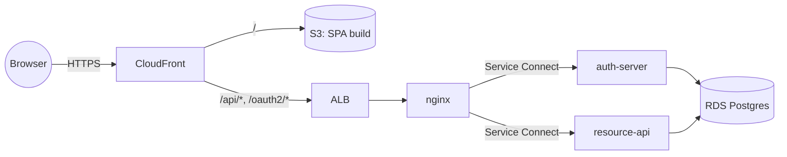

The first stretch into AWS. By the end of Part 7 you'll have Terraform that
can stand up the full prototype in your account — VPC, ECS Fargate +
Service Connect, ALB, RDS Postgres, ECR, S3 + CloudFront, optional WAF —
and tear it all down with one `terraform destroy`.

{/* truncate */}

## The whole journey

| # | What you'll do |
|---|---|
| 1 | Set up the monorepo |
| 2 | A Docusaurus docs site |
| 3 | auth-server |
| 4 | resource-api |
| 5 | nginx reverse proxy |
| 6 | The React SPA |
| 7 | **Terraform infrastructure** *(you are here)* |
| 8 | GitHub Actions — CI and CD |
| 9 | AWS account setup |
| 10 | First deploy and teardown |

## Prerequisites

- Parts 1–6 done. The local stack runs and the SPA logs in end-to-end.
- **Terraform 1.10+** — `brew install terraform`.

You do **not** need an AWS account configured yet. Part 7 is just writing
files and running `terraform validate`. Part 9 sets up the AWS account; Part
10 actually applies.

## What you'll build

A files-by-concern Terraform module under `infra/`:

```
infra/
├── versions.tf       # required providers + S3 backend declaration
├── providers.tf      # AWS provider + data sources
├── variables.tf      # input variables (project, env, region, …)
├── locals.tf         # computed values (name prefix, AZ list, services)
├── network.tf        # VPC + 2 public subnets + 3 security groups
├── data.tf           # RDS Postgres + SSM password
├── registry.tf       # 3 ECR repos with lifecycle policies
├── compute.tf        # ECS cluster + Service Connect + 3 services + ALB
├── frontend.tf       # S3 bucket + CloudFront for the SPA
├── waf.tf            # WAFv2 web ACL (optional, count-gated)
├── outputs.tf        # cloudfront_url, db_endpoint, etc.
├── terraform.tfvars
├── backend.hcl.example
└── bootstrap/        # one-time setup: state bucket + GitHub OIDC role
```

The bootstrap module runs once with local state to create the things the main
module's S3 backend and the CI/CD workflows depend on.

### Architecture



CloudFront is the single public origin. It serves the SPA from S3 and
forwards API/auth paths to the ALB. The ALB has exactly one target —
**nginx** — which uses ECS Service Connect to route to the two backend
services. RDS Postgres is private to the VPC.

## Step 1 — Scaffold and `versions.tf`

```sh
mkdir -p infra/bootstrap
cd infra
```

Create `infra/versions.tf`:

```hcl
terraform {
  required_version = ">= 1.10"

  required_providers {
    aws = {
      source  = "hashicorp/aws"
      version = "~> 5.0"
    }
    random = {
      source  = "hashicorp/random"
      version = "~> 3.6"
    }
  }

  # Remote state in S3. Configure at init time with the bucket created by
  # infra/bootstrap:
  #   terraform init -backend-config=backend.hcl
  backend "s3" {}
}
```

Two things to flag:

- The backend block is `backend "s3" {}` — no inline arguments. The bucket
  comes from `backend.hcl` at `terraform init` time, so the same files work
  for any state bucket you give them.
- Terraform 1.10+ supports **native S3 state locking** via `use_lockfile`
  (see `backend.hcl.example` below). No DynamoDB table needed.

## Step 2 — `providers.tf`

Create `infra/providers.tf`:

```hcl
provider "aws" {
  region = var.aws_region

  default_tags {
    tags = {
      Project     = var.project
      Environment = var.environment
      ManagedBy   = "terraform"
    }
  }
}

data "aws_availability_zones" "available" {
  state = "available"
}

data "aws_caller_identity" "current" {}
```

`default_tags` tags every taggable resource Terraform creates — handy for
cost reporting and for spotting orphans after a destroy.

## Step 3 — `variables.tf`

Create `infra/variables.tf`:

```hcl
variable "project" {
  description = "Project name, used as a prefix for resource names."
  type        = string
  default     = "api-gateway-pilot"
}

variable "environment" {
  description = "Environment name."
  type        = string
  default     = "dev"
}

variable "aws_region" {
  description = "AWS region to deploy into."
  type        = string
  default     = "us-east-1"
}

variable "vpc_cidr" {
  description = "CIDR block for the VPC."
  type        = string
  default     = "10.20.0.0/16"
}

variable "db_instance_class" {
  description = "RDS instance class."
  type        = string
  default     = "db.t4g.micro"
}

variable "db_name" {
  description = "PostgreSQL database name."
  type        = string
  default     = "apipilot"
}

variable "db_username" {
  description = "PostgreSQL master username."
  type        = string
  default     = "apipilot"
}

variable "image_tag" {
  description = "Container image tag to deploy. The deploy workflow sets this to the git SHA."
  type        = string
  default     = "latest"
}

variable "enable_waf" {
  description = "Attach an AWS WAF web ACL to the load balancer."
  type        = bool
  default     = false
}
```

`db.t4g.micro` is free-tier eligible and the cheapest class. `enable_waf`
is off by default — turning WAF on adds ~$5–10/mo.

## Step 4 — `locals.tf`

Create `infra/locals.tf`:

```hcl
locals {
  name = "${var.project}-${var.environment}"

  # Two availability zones for the public subnets.
  azs = slice(data.aws_availability_zones.available.names, 0, 2)

  services = ["auth-server", "resource-api", "nginx"]
}
```

`local.name` (`api-gateway-pilot-dev`) prefixes every resource so a second
environment in the same account would not collide. `local.services` drives
`for_each` over the ECR repos and log groups.

## Step 5 — `network.tf`

VPC, two public subnets, IGW, and three security groups. **No NAT Gateway** —
ECS tasks run in public subnets with public IPs. That saves ~$32/mo per AZ
versus a NAT, and the security groups still lock down who can talk to whom.

<details>
<summary>network.tf — VPC, subnets, security groups</summary>

```hcl
# VPC with two public subnets. No private subnets and no NAT Gateway — Fargate
# tasks run in public subnets with public IPs (a deliberate cost tradeoff for
# the prototype). Inbound access is still locked down by security groups.

resource "aws_vpc" "main" {
  cidr_block           = var.vpc_cidr
  enable_dns_support   = true
  enable_dns_hostnames = true

  tags = { Name = "${local.name}-vpc" }
}

resource "aws_internet_gateway" "main" {
  vpc_id = aws_vpc.main.id

  tags = { Name = "${local.name}-igw" }
}

resource "aws_subnet" "public" {
  count = 2

  vpc_id                  = aws_vpc.main.id
  cidr_block              = cidrsubnet(var.vpc_cidr, 8, count.index)
  availability_zone       = local.azs[count.index]
  map_public_ip_on_launch = true

  tags = { Name = "${local.name}-public-${count.index}" }
}

resource "aws_route_table" "public" {
  vpc_id = aws_vpc.main.id

  route {
    cidr_block = "0.0.0.0/0"
    gateway_id = aws_internet_gateway.main.id
  }

  tags = { Name = "${local.name}-public" }
}

resource "aws_route_table_association" "public" {
  count = 2

  subnet_id      = aws_subnet.public[count.index].id
  route_table_id = aws_route_table.public.id
}

# --- Security groups ---

resource "aws_security_group" "alb" {
  name        = "${local.name}-alb"
  description = "ALB — HTTP from the internet"
  vpc_id      = aws_vpc.main.id

  ingress {
    description = "HTTP"
    from_port   = 80
    to_port     = 80
    protocol    = "tcp"
    cidr_blocks = ["0.0.0.0/0"]
  }

  egress {
    from_port   = 0
    to_port     = 0
    protocol    = "-1"
    cidr_blocks = ["0.0.0.0/0"]
  }

  tags = { Name = "${local.name}-alb" }
}

resource "aws_security_group" "ecs" {
  name        = "${local.name}-ecs"
  description = "ECS tasks — from the ALB and from each other"
  vpc_id      = aws_vpc.main.id

  ingress {
    description     = "From the ALB"
    from_port       = 0
    to_port         = 65535
    protocol        = "tcp"
    security_groups = [aws_security_group.alb.id]
  }

  ingress {
    description = "Service-to-service (Service Connect)"
    from_port   = 0
    to_port     = 65535
    protocol    = "tcp"
    self        = true
  }

  egress {
    from_port   = 0
    to_port     = 0
    protocol    = "-1"
    cidr_blocks = ["0.0.0.0/0"]
  }

  tags = { Name = "${local.name}-ecs" }
}

resource "aws_security_group" "rds" {
  name        = "${local.name}-rds"
  description = "RDS — PostgreSQL from ECS tasks only"
  vpc_id      = aws_vpc.main.id

  ingress {
    description     = "PostgreSQL from ECS tasks"
    from_port       = 5432
    to_port         = 5432
    protocol        = "tcp"
    security_groups = [aws_security_group.ecs.id]
  }

  egress {
    from_port   = 0
    to_port     = 0
    protocol    = "-1"
    cidr_blocks = ["0.0.0.0/0"]
  }

  tags = { Name = "${local.name}-rds" }
}
```

</details>

`cidrsubnet(var.vpc_cidr, 8, count.index)` splits `10.20.0.0/16` into `/24`
subnets — `10.20.0.0/24` and `10.20.1.0/24`. The three SGs form a chain:
ALB SG accepts from the world; ECS SG accepts only from ALB SG (and itself
for Service Connect); RDS SG accepts only from ECS SG.

## Step 6 — `data.tf`

Create `infra/data.tf`:

```hcl
# RDS PostgreSQL backing the services. Single-AZ db.t4g.micro — the cheapest
# instance class and free-tier eligible.

resource "random_password" "db" {
  length  = 24
  special = false
}

# The database password is kept in SSM Parameter Store (free tier) and injected
# into the ECS tasks as an environment variable.
resource "aws_ssm_parameter" "db_password" {
  name  = "/${var.project}/${var.environment}/db-password"
  type  = "SecureString"
  value = random_password.db.result
}

resource "aws_db_subnet_group" "main" {
  name       = "${local.name}-db"
  subnet_ids = aws_subnet.public[*].id
}

resource "aws_db_instance" "main" {
  identifier     = "${local.name}-db"
  engine         = "postgres"
  engine_version = "16"
  instance_class = var.db_instance_class

  allocated_storage = 20
  storage_type      = "gp3"
  storage_encrypted = true

  db_name  = var.db_name
  username = var.db_username
  password = random_password.db.result

  db_subnet_group_name   = aws_db_subnet_group.main.name
  vpc_security_group_ids = [aws_security_group.rds.id]

  multi_az            = false
  publicly_accessible = false

  # The prototype is torn down and recreated freely; Flyway re-seeds demo data.
  skip_final_snapshot = true
  deletion_protection = false
  apply_immediately   = true

  tags = { Name = "${local.name}-db" }
}
```

`skip_final_snapshot = true` and `deletion_protection = false` are deliberate
prototype choices — `terraform destroy` needs to actually destroy. Flyway
re-seeds demo data on the next apply.

Notice the password never appears in Terraform code: `random_password`
generates one, SSM stores it, ECS injects it into the task at runtime.

## Step 7 — `registry.tf`

Three ECR repos, one per image. `force_delete = true` lets `terraform
destroy` remove them even when images are present — the deploy workflow
rebuilds and pushes images on the next run.

```hcl
resource "aws_ecr_repository" "this" {
  for_each = toset(local.services)

  name                 = "${var.project}/${each.key}"
  image_tag_mutability = "MUTABLE"
  force_delete         = true

  image_scanning_configuration {
    scan_on_push = true
  }
}

resource "aws_ecr_lifecycle_policy" "this" {
  for_each = aws_ecr_repository.this

  repository = each.value.name

  policy = jsonencode({
    rules = [{
      rulePriority = 1
      description  = "Expire untagged images after 7 days"
      selection = {
        tagStatus   = "untagged"
        countType   = "sinceImagePushed"
        countUnit   = "days"
        countNumber = 7
      }
      action = { type = "expire" }
    }]
  })
}
```

## Step 8 — `compute.tf`

The biggest file. It defines:

1. The ECS cluster + Service Connect HTTP namespace.
2. CloudWatch log groups (one per service).
3. IAM — a **task execution role** (lets ECS read SSM) and a **task role**
   (the app's own AWS identity — empty, since the app calls no AWS APIs).
4. Three task definitions + services: auth-server, resource-api, nginx.
5. The Application Load Balancer + target group + HTTP listener.

Only **nginx** is registered with the ALB target group. Internal traffic
between nginx → auth-server / resource-api goes over Service Connect.

<details>
<summary>compute.tf — ECS, IAM, three services, ALB</summary>

```hcl
# ECS Fargate cluster, the three services, and the Application Load Balancer.
# Service-to-service discovery uses ECS Service Connect; nginx is the only ALB
# target and forwards to the others.

# --- Cluster and Service Connect namespace ---

resource "aws_service_discovery_http_namespace" "main" {
  name = local.name
}

resource "aws_ecs_cluster" "main" {
  name = local.name

  service_connect_defaults {
    namespace = aws_service_discovery_http_namespace.main.arn
  }
}

resource "aws_cloudwatch_log_group" "this" {
  for_each = toset(local.services)

  name              = "/ecs/${local.name}/${each.key}"
  retention_in_days = 7
}

# --- IAM ---

data "aws_iam_policy_document" "ecs_assume" {
  statement {
    actions = ["sts:AssumeRole"]
    principals {
      type        = "Service"
      identifiers = ["ecs-tasks.amazonaws.com"]
    }
  }
}

resource "aws_iam_role" "task_execution" {
  name               = "${local.name}-task-exec"
  assume_role_policy = data.aws_iam_policy_document.ecs_assume.json
}

resource "aws_iam_role_policy_attachment" "task_execution" {
  role       = aws_iam_role.task_execution.name
  policy_arn = "arn:aws:iam::aws:policy/service-role/AmazonECSTaskExecutionRolePolicy"
}

# Lets ECS read the SecureString database password from SSM.
resource "aws_iam_role_policy" "task_execution_secrets" {
  name = "ssm-secrets"
  role = aws_iam_role.task_execution.id

  policy = jsonencode({
    Version = "2012-10-17"
    Statement = [
      {
        Effect   = "Allow"
        Action   = ["ssm:GetParameters"]
        Resource = [aws_ssm_parameter.db_password.arn]
      },
      {
        Effect   = "Allow"
        Action   = ["kms:Decrypt"]
        Resource = ["*"]
      }
    ]
  })
}

# Task role — the applications make no AWS API calls, so it has no policies.
resource "aws_iam_role" "task" {
  name               = "${local.name}-task"
  assume_role_policy = data.aws_iam_policy_document.ecs_assume.json
}

# --- Shared container settings ---

locals {
  db_environment = [
    { name = "DB_HOST", value = aws_db_instance.main.address },
    { name = "DB_PORT", value = "5432" },
    { name = "DB_NAME", value = var.db_name },
    { name = "DB_USERNAME", value = var.db_username },
  ]

  db_secrets = [
    { name = "DB_PASSWORD", valueFrom = aws_ssm_parameter.db_password.arn },
  ]

  public_url = "https://${aws_cloudfront_distribution.main.domain_name}"
}

# --- auth-server ---

resource "aws_ecs_task_definition" "auth_server" {
  family                   = "${local.name}-auth-server"
  requires_compatibilities = ["FARGATE"]
  network_mode             = "awsvpc"
  cpu                      = 512
  memory                   = 1024
  execution_role_arn       = aws_iam_role.task_execution.arn
  task_role_arn            = aws_iam_role.task.arn

  runtime_platform {
    cpu_architecture        = "X86_64"
    operating_system_family = "LINUX"
  }

  container_definitions = jsonencode([{
    name      = "auth-server"
    image     = "${aws_ecr_repository.this["auth-server"].repository_url}:${var.image_tag}"
    essential = true
    portMappings = [{
      name          = "auth"
      containerPort = 9000
      protocol      = "tcp"
      appProtocol   = "http"
    }]
    environment = concat(local.db_environment, [
      { name = "AUTH_SERVER_PORT", value = "9000" },
      { name = "AUTH_ISSUER_URI", value = local.public_url },
      { name = "CORS_ALLOWED_ORIGINS", value = local.public_url },
      { name = "SPA_REDIRECT_URIS", value = "${local.public_url}/callback" },
    ])
    secrets = local.db_secrets
    healthCheck = {
      command     = ["CMD-SHELL", "curl -fsS http://localhost:9000/actuator/health || exit 1"]
      interval    = 30
      timeout     = 5
      retries     = 5
      startPeriod = 120
    }
    logConfiguration = {
      logDriver = "awslogs"
      options = {
        "awslogs-group"         = aws_cloudwatch_log_group.this["auth-server"].name
        "awslogs-region"        = var.aws_region
        "awslogs-stream-prefix" = "auth-server"
      }
    }
  }])
}

resource "aws_ecs_service" "auth_server" {
  name            = "auth-server"
  cluster         = aws_ecs_cluster.main.id
  task_definition = aws_ecs_task_definition.auth_server.arn
  desired_count   = 1
  launch_type     = "FARGATE"

  network_configuration {
    subnets          = aws_subnet.public[*].id
    security_groups  = [aws_security_group.ecs.id]
    assign_public_ip = true
  }

  service_connect_configuration {
    enabled   = true
    namespace = aws_service_discovery_http_namespace.main.arn
    service {
      port_name      = "auth"
      discovery_name = "auth-server"
      client_alias {
        port     = 9000
        dns_name = "auth-server"
      }
    }
  }
}

# --- resource-api ---

resource "aws_ecs_task_definition" "resource_api" {
  family                   = "${local.name}-resource-api"
  requires_compatibilities = ["FARGATE"]
  network_mode             = "awsvpc"
  cpu                      = 512
  memory                   = 1024
  execution_role_arn       = aws_iam_role.task_execution.arn
  task_role_arn            = aws_iam_role.task.arn

  runtime_platform {
    cpu_architecture        = "X86_64"
    operating_system_family = "LINUX"
  }

  container_definitions = jsonencode([{
    name      = "resource-api"
    image     = "${aws_ecr_repository.this["resource-api"].repository_url}:${var.image_tag}"
    essential = true
    portMappings = [{
      name          = "resource"
      containerPort = 8080
      protocol      = "tcp"
      appProtocol   = "http"
    }]
    environment = concat(local.db_environment, [
      { name = "RESOURCE_API_PORT", value = "8080" },
      { name = "JWK_SET_URI", value = "http://auth-server:9000/oauth2/jwks" },
      { name = "CORS_ALLOWED_ORIGINS", value = local.public_url },
    ])
    secrets = local.db_secrets
    healthCheck = {
      command     = ["CMD-SHELL", "curl -fsS http://localhost:8080/actuator/health || exit 1"]
      interval    = 30
      timeout     = 5
      retries     = 5
      startPeriod = 120
    }
    logConfiguration = {
      logDriver = "awslogs"
      options = {
        "awslogs-group"         = aws_cloudwatch_log_group.this["resource-api"].name
        "awslogs-region"        = var.aws_region
        "awslogs-stream-prefix" = "resource-api"
      }
    }
  }])
}

resource "aws_ecs_service" "resource_api" {
  name            = "resource-api"
  cluster         = aws_ecs_cluster.main.id
  task_definition = aws_ecs_task_definition.resource_api.arn
  desired_count   = 1
  launch_type     = "FARGATE"

  network_configuration {
    subnets          = aws_subnet.public[*].id
    security_groups  = [aws_security_group.ecs.id]
    assign_public_ip = true
  }

  service_connect_configuration {
    enabled   = true
    namespace = aws_service_discovery_http_namespace.main.arn
    service {
      port_name      = "resource"
      discovery_name = "resource-api"
      client_alias {
        port     = 8080
        dns_name = "resource-api"
      }
    }
  }
}

# --- nginx (the only ALB target) ---

resource "aws_ecs_task_definition" "nginx" {
  family                   = "${local.name}-nginx"
  requires_compatibilities = ["FARGATE"]
  network_mode             = "awsvpc"
  cpu                      = 256
  memory                   = 512
  execution_role_arn       = aws_iam_role.task_execution.arn
  task_role_arn            = aws_iam_role.task.arn

  runtime_platform {
    cpu_architecture        = "X86_64"
    operating_system_family = "LINUX"
  }

  container_definitions = jsonencode([{
    name      = "nginx"
    image     = "${aws_ecr_repository.this["nginx"].repository_url}:${var.image_tag}"
    essential = true
    portMappings = [{
      name          = "nginx"
      containerPort = 8088
      protocol      = "tcp"
      appProtocol   = "http"
    }]
    healthCheck = {
      command     = ["CMD-SHELL", "wget -q -O- http://localhost:8088/healthz || exit 1"]
      interval    = 30
      timeout     = 5
      retries     = 3
      startPeriod = 15
    }
    logConfiguration = {
      logDriver = "awslogs"
      options = {
        "awslogs-group"         = aws_cloudwatch_log_group.this["nginx"].name
        "awslogs-region"        = var.aws_region
        "awslogs-stream-prefix" = "nginx"
      }
    }
  }])
}

resource "aws_ecs_service" "nginx" {
  name            = "nginx"
  cluster         = aws_ecs_cluster.main.id
  task_definition = aws_ecs_task_definition.nginx.arn
  desired_count   = 1
  launch_type     = "FARGATE"

  health_check_grace_period_seconds = 120

  network_configuration {
    subnets          = aws_subnet.public[*].id
    security_groups  = [aws_security_group.ecs.id]
    assign_public_ip = true
  }

  load_balancer {
    target_group_arn = aws_lb_target_group.nginx.arn
    container_name   = "nginx"
    container_port   = 8088
  }

  # nginx is a Service Connect client — it resolves auth-server and resource-api.
  service_connect_configuration {
    enabled   = true
    namespace = aws_service_discovery_http_namespace.main.arn
  }

  depends_on = [aws_lb_listener.http]
}

# --- Application Load Balancer ---

resource "aws_lb" "main" {
  name               = "${local.name}-alb"
  load_balancer_type = "application"
  internal           = false
  security_groups    = [aws_security_group.alb.id]
  subnets            = aws_subnet.public[*].id
}

resource "aws_lb_target_group" "nginx" {
  name        = "${local.name}-nginx"
  port        = 8088
  protocol    = "HTTP"
  vpc_id      = aws_vpc.main.id
  target_type = "ip"

  health_check {
    path                = "/healthz"
    matcher             = "200"
    interval            = 30
    timeout             = 5
    healthy_threshold   = 2
    unhealthy_threshold = 3
  }
}

resource "aws_lb_listener" "http" {
  load_balancer_arn = aws_lb.main.arn
  port              = 80
  protocol          = "HTTP"

  default_action {
    type             = "forward"
    target_group_arn = aws_lb_target_group.nginx.arn
  }
}
```

</details>

Key bits to call out:

- **Service Connect**. The two backend services each register under
  `discovery_name` with a `client_alias` (`auth-server:9000`,
  `resource-api:8080`). The nginx service's `service_connect_configuration`
  block has no `service {}` — it's a client only, so it can resolve those
  names. This is why your local `nginx.conf` (Part 5) using
  `auth-server:9000` and `resource-api:8080` Just Works in AWS too.
- **Public URL is the CloudFront domain**, computed in `local.public_url`.
  The auth-server's `AUTH_ISSUER_URI` and the SPA's allowed redirect URI
  both point at it. The CloudFront distribution is defined in `frontend.tf`
  next, which Terraform's graph resolves automatically.
- **Health-check grace period**: 120s on the nginx service gives Spring Boot
  time to come up before the ALB starts deregistering tasks.

## Step 9 — `frontend.tf`

S3 for the SPA, CloudFront in front of it. CloudFront also forwards API and
auth paths to the ALB, so the browser only ever talks to one HTTPS origin
(no CORS in production).

<details>
<summary>frontend.tf — S3 + CloudFront + SPA routing function</summary>

```hcl
# S3 + CloudFront for the React SPA. CloudFront is the single public origin: it
# serves the SPA from S3 and forwards API and auth paths to the ALB, so the
# browser only ever talks to one HTTPS origin.

resource "aws_s3_bucket" "spa" {
  bucket        = "${local.name}-spa-${data.aws_caller_identity.current.account_id}"
  force_destroy = true
}

resource "aws_s3_bucket_public_access_block" "spa" {
  bucket = aws_s3_bucket.spa.id

  block_public_acls       = true
  block_public_policy     = true
  ignore_public_acls      = true
  restrict_public_buckets = true
}

resource "aws_cloudfront_origin_access_control" "spa" {
  name                              = "${local.name}-spa"
  origin_access_control_origin_type = "s3"
  signing_behavior                  = "always"
  signing_protocol                  = "sigv4"
}

# Rewrites extensionless paths (e.g. /callback) to /index.html so the SPA
# handles client-side routing. Scoped to the SPA behavior only, so API
# responses are untouched.
resource "aws_cloudfront_function" "spa_router" {
  name    = "${local.name}-spa-router"
  runtime = "cloudfront-js-2.0"
  code    = <<-EOT
    function handler(event) {
      var request = event.request;
      if (request.uri.indexOf('.') === -1) {
        request.uri = '/index.html';
      }
      return request;
    }
  EOT
}

# AWS-managed CloudFront policies.
data "aws_cloudfront_cache_policy" "optimized" {
  name = "Managed-CachingOptimized"
}

data "aws_cloudfront_cache_policy" "disabled" {
  name = "Managed-CachingDisabled"
}

data "aws_cloudfront_origin_request_policy" "all_viewer" {
  name = "Managed-AllViewer"
}

locals {
  # Paths CloudFront forwards to the ALB rather than serving from S3.
  alb_path_patterns = [
    "/api/*",
    "/oauth2/*",
    "/.well-known/*",
    "/login",
    "/logout",
    "/userinfo",
    "/connect/*",
  ]
}

resource "aws_cloudfront_distribution" "main" {
  enabled             = true
  comment             = local.name
  default_root_object = "index.html"
  price_class         = "PriceClass_100"

  # SPA static assets.
  origin {
    origin_id                = "spa"
    domain_name              = aws_s3_bucket.spa.bucket_regional_domain_name
    origin_access_control_id = aws_cloudfront_origin_access_control.spa.id
  }

  # API and auth traffic to the ALB / nginx.
  origin {
    origin_id   = "alb"
    domain_name = aws_lb.main.dns_name

    custom_origin_config {
      http_port              = 80
      https_port             = 443
      origin_protocol_policy = "http-only"
      origin_ssl_protocols   = ["TLSv1.2"]
    }
  }

  default_cache_behavior {
    target_origin_id       = "spa"
    viewer_protocol_policy = "redirect-to-https"
    allowed_methods        = ["GET", "HEAD", "OPTIONS"]
    cached_methods         = ["GET", "HEAD"]
    cache_policy_id        = data.aws_cloudfront_cache_policy.optimized.id

    function_association {
      event_type   = "viewer-request"
      function_arn = aws_cloudfront_function.spa_router.arn
    }
  }

  dynamic "ordered_cache_behavior" {
    for_each = local.alb_path_patterns
    content {
      path_pattern             = ordered_cache_behavior.value
      target_origin_id         = "alb"
      viewer_protocol_policy   = "redirect-to-https"
      allowed_methods          = ["GET", "HEAD", "OPTIONS", "PUT", "POST", "PATCH", "DELETE"]
      cached_methods           = ["GET", "HEAD"]
      cache_policy_id          = data.aws_cloudfront_cache_policy.disabled.id
      origin_request_policy_id = data.aws_cloudfront_origin_request_policy.all_viewer.id
    }
  }

  restrictions {
    geo_restriction {
      restriction_type = "none"
    }
  }

  viewer_certificate {
    cloudfront_default_certificate = true
  }
}

# Allow CloudFront (and only this distribution) to read the SPA bucket.
resource "aws_s3_bucket_policy" "spa" {
  bucket = aws_s3_bucket.spa.id

  policy = jsonencode({
    Version = "2012-10-17"
    Statement = [{
      Sid       = "AllowCloudFrontServicePrincipal"
      Effect    = "Allow"
      Principal = { Service = "cloudfront.amazonaws.com" }
      Action    = "s3:GetObject"
      Resource  = "${aws_s3_bucket.spa.arn}/*"
      Condition = {
        StringEquals = {
          "AWS:SourceArn" = aws_cloudfront_distribution.main.arn
        }
      }
    }]
  })
}
```

</details>

The interesting parts:

- **Two origins, one distribution**. `default_cache_behavior` points at the
  S3 SPA origin. The `dynamic "ordered_cache_behavior"` block creates one
  behavior per `alb_path_patterns` entry, each forwarding to the ALB origin
  with caching **disabled** (these are API responses).
- **SPA router function**. `react-oidc-context` redirects users to `/callback`
  with a `?code=...` query string. There is no `callback.html` in `dist/`,
  so by default CloudFront would 404. The `cloudfront-js-2.0` function
  rewrites any extensionless path to `/index.html`, letting the SPA pick up
  and finish the auth flow.
- **OAC**, not OAI. Origin Access Control is the modern, sigv4-based way to
  let CloudFront read a private S3 bucket. The bucket policy condition pins
  it to **this distribution only**.

## Step 10 — `waf.tf`

Optional. Off by default; flip `enable_waf = true` in `terraform.tfvars` to
turn it on.

```hcl
# AWS WAF web ACL for the ALB. Optional — enabled with `enable_waf = true`,
# since it adds a monthly cost.

resource "aws_wafv2_web_acl" "main" {
  count = var.enable_waf ? 1 : 0

  name  = "${local.name}-waf"
  scope = "REGIONAL"

  default_action {
    allow {}
  }

  rule {
    name     = "AWSManagedCommonRuleSet"
    priority = 1

    override_action {
      none {}
    }

    statement {
      managed_rule_group_statement {
        name        = "AWSManagedRulesCommonRuleSet"
        vendor_name = "AWS"
      }
    }

    visibility_config {
      cloudwatch_metrics_enabled = true
      metric_name                = "${local.name}-common"
      sampled_requests_enabled   = true
    }
  }

  rule {
    name     = "RateLimit"
    priority = 2

    action {
      block {}
    }

    statement {
      rate_based_statement {
        limit              = 2000
        aggregate_key_type = "IP"
      }
    }

    visibility_config {
      cloudwatch_metrics_enabled = true
      metric_name                = "${local.name}-ratelimit"
      sampled_requests_enabled   = true
    }
  }

  visibility_config {
    cloudwatch_metrics_enabled = true
    metric_name                = "${local.name}-waf"
    sampled_requests_enabled   = true
  }
}

resource "aws_wafv2_web_acl_association" "alb" {
  count = var.enable_waf ? 1 : 0

  resource_arn = aws_lb.main.arn
  web_acl_arn  = aws_wafv2_web_acl.main[0].arn
}
```

`count = var.enable_waf ? 1 : 0` is the standard idiom for an
"optional resource block" in Terraform.

## Step 11 — `outputs.tf`

```hcl
output "cloudfront_url" {
  description = "Public URL of the prototype (SPA + API)."
  value       = "https://${aws_cloudfront_distribution.main.domain_name}"
}

output "cloudfront_distribution_id" {
  description = "CloudFront distribution id (used for cache invalidation)."
  value       = aws_cloudfront_distribution.main.id
}

output "spa_bucket" {
  description = "S3 bucket the SPA build is uploaded to."
  value       = aws_s3_bucket.spa.id
}

output "alb_dns_name" {
  description = "Internal-facing ALB DNS name."
  value       = aws_lb.main.dns_name
}

output "ecr_repository_urls" {
  description = "ECR repository URLs for each service image."
  value       = { for name, repo in aws_ecr_repository.this : name => repo.repository_url }
}

output "db_endpoint" {
  description = "RDS endpoint address."
  value       = aws_db_instance.main.address
}
```

The deploy workflow (Part 8) reads `spa_bucket`, `cloudfront_distribution_id`,
and `ecr_repository_urls` from these outputs.

## Step 12 — `terraform.tfvars` and `backend.hcl.example`

`infra/terraform.tfvars`:

```hcl
aws_region  = "us-east-1"
environment = "dev"

# Set to true to attach AWS WAF to the load balancer (adds monthly cost).
enable_waf = false
```

`infra/backend.hcl.example`:

```hcl
# Copy to backend.hcl and fill in the state bucket from `infra/bootstrap`.
# Then: terraform init -backend-config=backend.hcl
bucket       = "REPLACE-WITH-STATE-BUCKET-NAME"
key          = "dev/terraform.tfstate"
region       = "us-east-1"
use_lockfile = true
```

`use_lockfile = true` is the Terraform 1.10+ native S3 locking. Older guides
will tell you to add a DynamoDB table — you don't need one anymore.

`backend.hcl` itself is gitignored (it would be different for each
environment / state bucket).

## Step 13 — The bootstrap module

`infra/bootstrap/` is a separate Terraform configuration with **local state**
that you run once per AWS account. It creates:

1. The S3 bucket the main module's remote state lives in.
2. The GitHub OIDC identity provider in IAM.
3. An IAM role the deploy workflow (Part 8) assumes via OIDC.

It's a separate config because of the chicken-and-egg problem: the main
module's backend needs the state bucket to exist before `terraform init`
will work.

Create `infra/bootstrap/main.tf`:

<details>
<summary>bootstrap/main.tf — state bucket + GitHub OIDC + deploy role</summary>

```hcl
# One-time bootstrap, applied manually with local state. Creates the things the
# main Terraform configuration and the GitHub Actions deploy workflow depend on:
# the remote-state S3 bucket and the GitHub OIDC deploy role.

terraform {
  required_version = ">= 1.9"

  required_providers {
    aws = {
      source  = "hashicorp/aws"
      version = "~> 5.0"
    }
    tls = {
      source  = "hashicorp/tls"
      version = "~> 4.0"
    }
  }
}

provider "aws" {
  region = var.aws_region
}

# --- Terraform remote-state bucket ---

resource "aws_s3_bucket" "state" {
  bucket = var.state_bucket_name
}

resource "aws_s3_bucket_versioning" "state" {
  bucket = aws_s3_bucket.state.id
  versioning_configuration {
    status = "Enabled"
  }
}

resource "aws_s3_bucket_server_side_encryption_configuration" "state" {
  bucket = aws_s3_bucket.state.id
  rule {
    apply_server_side_encryption_by_default {
      sse_algorithm = "AES256"
    }
  }
}

resource "aws_s3_bucket_public_access_block" "state" {
  bucket                  = aws_s3_bucket.state.id
  block_public_acls       = true
  block_public_policy     = true
  ignore_public_acls      = true
  restrict_public_buckets = true
}

# --- GitHub Actions OIDC ---

data "tls_certificate" "github" {
  url = "https://token.actions.githubusercontent.com/.well-known/openid-configuration"
}

resource "aws_iam_openid_connect_provider" "github" {
  url             = "https://token.actions.githubusercontent.com"
  client_id_list  = ["sts.amazonaws.com"]
  thumbprint_list = [data.tls_certificate.github.certificates[0].sha1_fingerprint]
}

resource "aws_iam_role" "deploy" {
  name = "${var.project}-github-deploy"

  assume_role_policy = jsonencode({
    Version = "2012-10-17"
    Statement = [{
      Effect    = "Allow"
      Principal = { Federated = aws_iam_openid_connect_provider.github.arn }
      Action    = "sts:AssumeRoleWithWebIdentity"
      Condition = {
        StringEquals = {
          "token.actions.githubusercontent.com:aud" = "sts.amazonaws.com"
        }
        StringLike = {
          "token.actions.githubusercontent.com:sub" = "repo:${var.github_repo}:*"
        }
      }
    }]
  })
}

# Broad permissions — the deploy workflow provisions the entire stack. Scope
# this down for anything beyond a prototype.
resource "aws_iam_role_policy_attachment" "deploy" {
  role       = aws_iam_role.deploy.name
  policy_arn = "arn:aws:iam::aws:policy/AdministratorAccess"
}
```

</details>

Note the **AdministratorAccess** policy on the deploy role. It's defensible
for a personal prototype where the role can only be assumed by your one
repo, and you'd otherwise spend a day enumerating the dozens of services
Terraform touches. Scope it down for anything real.

Create `infra/bootstrap/variables.tf`:

```hcl
variable "aws_region" {
  description = "AWS region."
  type        = string
  default     = "us-east-1"
}

variable "project" {
  description = "Project name."
  type        = string
  default     = "api-gateway-pilot"
}

variable "state_bucket_name" {
  description = "Globally-unique name for the Terraform remote-state S3 bucket."
  type        = string
}

variable "github_repo" {
  description = "GitHub repository allowed to assume the deploy role (owner/name)."
  type        = string
  default     = "allxsmith/api-gateway-pilot"
}
```

:::caution Edit `github_repo` before applying
The `github_repo` default is set to my repo (`allxsmith/api-gateway-pilot`).
**You must change it to your own `owner/name`** before `terraform apply`,
either by editing the default in this file or by passing
`-var "github_repo=yourname/yourrepo"` on the command line.

If you don't, the IAM role's trust policy will only let *my* repo assume
it, and your GitHub Actions deploy in Part 10 will fail with `Not
authorized to perform sts:AssumeRoleWithWebIdentity`.
:::

Create `infra/bootstrap/outputs.tf`:

```hcl
output "state_bucket" {
  description = "Terraform remote-state bucket. Use it in infra/backend.hcl."
  value       = aws_s3_bucket.state.id
}

output "deploy_role_arn" {
  description = "IAM role ARN for GitHub Actions. Set it as the AWS_DEPLOY_ROLE repo variable."
  value       = aws_iam_role.deploy.arn
}
```

## Verify

You don't have AWS credentials wired up yet (that's Part 9), but you can
still ask Terraform to check its own syntax. From `infra/`:

```sh
terraform fmt -recursive -check
```

Should print nothing and exit 0.

To run `terraform validate`, Terraform needs an initialized provider — it
doesn't need real credentials, but `terraform init` against an S3 backend
does. The simplest local check is to validate the bootstrap config (no S3
backend):

```sh
cd bootstrap
terraform init -backend=false
terraform validate
```

Expected:

```
Success! The configuration is valid.
```

The main module gets a real `terraform init`/`validate` in Part 10 once the
state bucket exists.

## Commit

```sh
cd ../..
git add -A
git commit -m "feat: terraform infrastructure"
```

## What's next

**Part 8 — GitHub Actions, CI and CD.** Four workflows: `ci.yml` (build &
test on PRs), `deploy.yml` (the OIDC + ECR + Terraform apply + SPA-sync
pipeline), `teardown.yml` (the one-click "stop billing" button), and
`docs.yml` (publishes this docs site to GitHub Pages).
