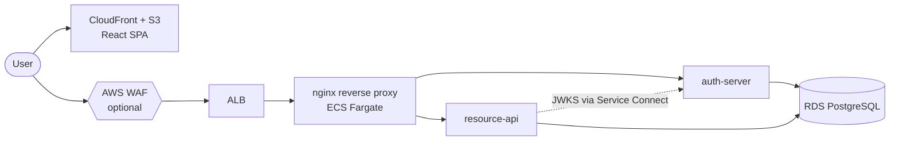

# Architecture overview

A small AWS stack: CloudFront for the React SPA, an ALB in front of an nginx
reverse proxy, and two Spring services sharing a PostgreSQL database.

## The stack

## Components

| Layer | Technology |
| --- | --- |
| SPA hosting / CDN | CloudFront + S3 |
| Web application firewall | AWS WAF (optional; off by default to keep costs at zero) |
| Load balancer | Application Load Balancer |
| Reverse proxy | nginx on ECS Fargate |
| Service discovery | ECS Service Connect |
| Application runtime | ECS Fargate (x86_64) |
| Database | RDS PostgreSQL `db.t4g.micro` |
| Image registry | Amazon ECR |
| Secrets | SSM Parameter Store |
| Infrastructure as code | Terraform |
| CI/CD | GitHub Actions, OIDC to AWS |

## A note on "nginx ingress / egress"

Those are **Kubernetes** terms — the `nginx-ingress` controller routes traffic
inside an EKS cluster. This architecture runs on **ECS, not Kubernetes**, so
they do not apply. The ALB is the ingress point; egress is simply the task's
route out through the internet gateway. The prototype includes a plain nginx
**reverse proxy** (a container), which is a different, container-level concern.

## Request path

1. The browser loads the React SPA from CloudFront.
2. API calls hit the ALB (optionally screened by AWS WAF first).
3. The ALB forwards to the nginx reverse proxy.
4. nginx routes by path: auth endpoints to `auth-server`, everything under
   `/api` to `resource-api`.
5. `resource-api` validates the request's JWT against `auth-server`'s public
   keys, reachable over ECS Service Connect.
6. Both services read and write the same RDS PostgreSQL instance, in separate
   schemas (`auth` and `app`).

## Where this is heading

Once the prototype is stable, the plan is to replace `auth-server` with
**Amazon Cognito** and the nginx/ALB front with **Amazon API Gateway**. The
prototype exists to make that direction easy to plan.
